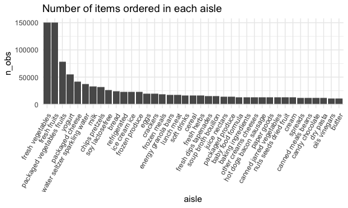
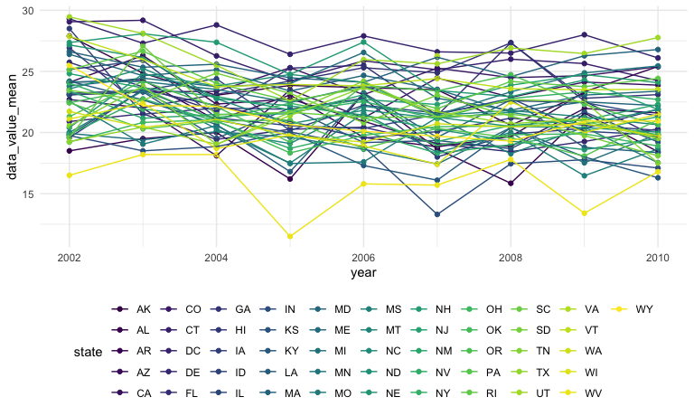
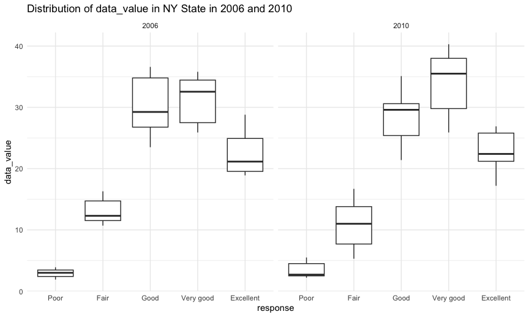

p8105_hw3_yw3996
================
Yiying Wu

## 1. Instacart data

load the data from the p8105.datasets using:

``` r
library(p8105.datasets)
data("instacart")
instacart=instacart
```

### Description of the dataset

-   This dataset contains 1384617 rows and 15 columns, with each row
    resprenting a single product from an instacart order.

-   Variables include

    -   `order_id`: order identifier
    -   `product_id`: product identifier
    -   `add_to_cart_order`: order in which each product was added to
        cart
    -   `reordered`: 1 if this prodcut has been ordered by this user in
        the past, 0 otherwise
    -   `user_id`: customer identifier
    -   `eval_set`: which evaluation set this order belongs in (Note
        that the data for use in this class is exclusively from the
        “train” eval_set)
    -   `order_number`: the order sequence number for this user
        (1=first, n=nth)
    -   `order_dow`: the day of the week on which the order was placed
    -   `order_hour_of_day`: the hour of the day on which the order was
        placed
    -   `days_since_prior_order`: days since the last order, capped at
        30, NA if order_number=1
    -   `product_name`: name of the product
    -   `aisle_id`: aisle identifier
    -   `department_id`: department identifier
    -   `aisle`: the name of the aisle
    -   `department`: the name of the department

### Count the number of aisles and the aisles with most items ordered

Count the number of aisles in the dataset:

``` r
n_distinct(instacart$aisle)
```

    ## [1] 134

Count the number of orders in each aisle and sort by descending order:

``` r
instacart |>
  group_by(aisle) |>
  summarize(n_obs = n())|>
  arrange(desc(n_obs))
```

    ## # A tibble: 134 × 2
    ##    aisle                          n_obs
    ##    <chr>                          <int>
    ##  1 fresh vegetables              150609
    ##  2 fresh fruits                  150473
    ##  3 packaged vegetables fruits     78493
    ##  4 yogurt                         55240
    ##  5 packaged cheese                41699
    ##  6 water seltzer sparkling water  36617
    ##  7 milk                           32644
    ##  8 chips pretzels                 31269
    ##  9 soy lactosefree                26240
    ## 10 bread                          23635
    ## # ℹ 124 more rows

Therefore, there are 134 aisles. The most items are ordered from fresh
vegetables aisles.

### Plot 1

the number of items ordered in each aisle (aisles with more than 10000
items ordered)

``` r
instacart |>
  group_by(aisle) |>
  summarize(n_obs = n()) |>
  filter(n_obs > 10000) |>
  mutate(aisle = fct_reorder(aisle, desc(n_obs))) |>
  ggplot(aes(x = aisle, y = n_obs)) + 
  geom_bar(stat = "identity") +  # Use geom_bar for a bar chart
  labs(title = "Number of items ordered in each aisle") +
  theme(axis.text.x = element_text(angle = 60, hjust = 1))
```



### Table 1

the three most popular items in each of the aisles “baking ingredients”,
“dog food care”, and “packaged vegetables fruits” with the number of
times each item is ordered

``` r
instacart |> 
  filter(aisle %in% c("baking ingredients", 
                      "dog food care", 
                      "packaged vegetables fruits")) |>
  group_by(aisle) |> 
  count(product_name) |> 
  mutate(rank = min_rank(desc(n))) |> 
  filter(rank < 4) |> 
  arrange(desc(n)) |>
  knitr::kable()
```

| aisle                      | product_name                                  |    n | rank |
|:---------------------------|:----------------------------------------------|-----:|-----:|
| packaged vegetables fruits | Organic Baby Spinach                          | 9784 |    1 |
| packaged vegetables fruits | Organic Raspberries                           | 5546 |    2 |
| packaged vegetables fruits | Organic Blueberries                           | 4966 |    3 |
| baking ingredients         | Light Brown Sugar                             |  499 |    1 |
| baking ingredients         | Pure Baking Soda                              |  387 |    2 |
| baking ingredients         | Cane Sugar                                    |  336 |    3 |
| dog food care              | Snack Sticks Chicken & Rice Recipe Dog Treats |   30 |    1 |
| dog food care              | Organix Chicken & Brown Rice Recipe           |   28 |    2 |
| dog food care              | Small Dog Biscuits                            |   26 |    3 |

### Table 2

the mean hour of the day at which Pink Lady Apples and Coffee Ice Cream
are ordered on each day of the week; format this table for human readers
(i.e. produce a 2 x 7 table).

``` r
instacart |>
  filter(product_name %in% c("Pink Lady Apples", "Coffee Ice Cream")) |>
  group_by(product_name, order_dow) |>
  summarize(mean_hour = mean(order_hour_of_day)) |>
  pivot_wider(
    names_from = "order_dow", 
    values_from = "mean_hour")|>
  knitr::kable(digits = 2)
```

    ## `summarise()` has grouped output by 'product_name'. You can override using the
    ## `.groups` argument.

| product_name     |     0 |     1 |     2 |     3 |     4 |     5 |     6 |
|:-----------------|------:|------:|------:|------:|------:|------:|------:|
| Coffee Ice Cream | 13.77 | 14.32 | 15.38 | 15.32 | 15.22 | 12.26 | 13.83 |
| Pink Lady Apples | 13.44 | 11.36 | 11.70 | 14.25 | 11.55 | 12.78 | 11.94 |

## 2. BRFSS data

load the data from the p8105.datasets using:

``` r
data("BRFSS")
brfss=brfss_smart2010
```

### data cleaning

-   format the data to use appropriate variable names;
-   focus on the “Overall Health” topic
-   include only responses from “Excellent” to “Poor”
-   organize responses as a factor taking levels ordered from “Poor” to
    “Excellent”

list all the value of response column:

``` r
brfss=brfss|>
  janitor::clean_names()|>
  mutate(data_value=as.double(data_value))
unique(brfss$response)
```

    ##  [1] "Excellent"                                 
    ##  [2] "Very good"                                 
    ##  [3] "Good"                                      
    ##  [4] "Fair"                                      
    ##  [5] "Poor"                                      
    ##  [6] "Good or Better Health"                     
    ##  [7] "Fair or Poor Health"                       
    ##  [8] "Yes"                                       
    ##  [9] "No"                                        
    ## [10] "Yes, pregnancy-related"                    
    ## [11] "No, pre-diabetes or borderline diabetes"   
    ## [12] "Smoke everyday"                            
    ## [13] "Smoke some days"                           
    ## [14] "Former smoker"                             
    ## [15] "Never smoked"                              
    ## [16] "Neither overweight nor obese (BMI le 24.9)"
    ## [17] "Overweight (BMI 25.0-29.9)"                
    ## [18] "Obese (BMI 30.0 - 99.8)"                   
    ## [19] "Checked in past 5 years"                   
    ## [20] "Not Checked in past 5 years"               
    ## [21] "Never Checked"                             
    ## [22] "Consume 5 or more times per day"           
    ## [23] "Consume less than 5 times per day"

The responses should be included are “Excellent”, “Very good”, “Good”,
“Fair”, “Poor”.

The order should be “Poor”, “Fair”, “Good”, “Very good”, “Excellent”

``` r
brfss=brfss|>
  filter(
    topic=="Overall Health",
    response %in% c("Poor", "Fair", "Good", 
                    "Very good", "Excellent"))|>
  mutate(
    response=factor(response, levels=c("Poor", "Fair", "Good", 
                                       "Very good", "Excellent"))
  )
```

### states observed at 7 or more locations in 2002 or in 2010

states were observed at 7 or more locations in 2002 are:

``` r
brfss|>
  filter(year==2002)|>
  group_by(locationabbr)|>
  summarize(n_obs = n_distinct(locationdesc))|>
  filter(n_obs>=7)
```

    ## # A tibble: 6 × 2
    ##   locationabbr n_obs
    ##   <chr>        <int>
    ## 1 CT               7
    ## 2 FL               7
    ## 3 MA               8
    ## 4 NC               7
    ## 5 NJ               8
    ## 6 PA              10

CT, FL, MA, NC, NJ, PA were observed at 7 or more locations in 2002.

states were observed at 7 or more locations in 2010 are:

``` r
brfss|>
  filter(year==2010)|>
  group_by(locationabbr)|>
  summarize(n_obs = n_distinct(locationdesc))|>
  filter(n_obs>=7)
```

    ## # A tibble: 14 × 2
    ##    locationabbr n_obs
    ##    <chr>        <int>
    ##  1 CA              12
    ##  2 CO               7
    ##  3 FL              41
    ##  4 MA               9
    ##  5 MD              12
    ##  6 NC              12
    ##  7 NE              10
    ##  8 NJ              19
    ##  9 NY               9
    ## 10 OH               8
    ## 11 PA               7
    ## 12 SC               7
    ## 13 TX              16
    ## 14 WA              10

CA, CO, FL, MA, MD, NC, NE, NJ, NY, OH, PA, SC, TX, WA were observed at
7 or more locations in 2010.

### Construct a dataset with Excellent responses including year, state, and a variable that averages the data_value across locations within a state

``` r
dat = brfss|>
  filter(response=="Excellent")|>
  group_by(year, locationabbr)|>
  summarize(data_value_mean=mean(data_value, na.rm = TRUE))
```

    ## `summarise()` has grouped output by 'year'. You can override using the
    ## `.groups` argument.

### spaghetti plot

``` r
dat|>
  rename("state"="locationabbr")|>
  ggplot(aes(x = year, y = data_value_mean, 
             color =state )) + 
  geom_point() + geom_line() + 
  theme(legend.position = "bottom")+
  guides(color = guide_legend(nrow = 5))
```



### two-panel plot

two-panel plot showing, for the years 2006, and 2010, distribution of
data_value for responses (“Poor” to “Excellent”) among locations in NY
State.

``` r
plot_2006=
  brfss |>
  filter(locationabbr=="NY",year==2006)|>
  ggplot(aes(x =locationdesc , y = data_value,fill=response)) + 
  geom_bar(position="dodge",stat="identity") +  
  labs(title = "Distribution of data_value in NY State in 2006") +
  theme(axis.text.x = element_text(angle = 15, hjust = 1),legend.position = "none")

plot_2010=
  brfss |>
  filter(locationabbr=="NY",year==2010)|>
  ggplot(aes(x =locationdesc , y = data_value,fill=response)) + 
  geom_bar(position="dodge",stat="identity") +  
  labs(title = "Distribution of data_value in NY State in 2010") +
  theme(axis.text.x = element_text(angle = 15, hjust = 1))

plot_2006 + plot_2010
```



## 3. Accelerometer data

import dataset

``` r
demographic=read_csv("./data/nhanes_covar.csv",skip = 4)
accelerometer=read_csv("./data/nhanes_accel.csv")
```
