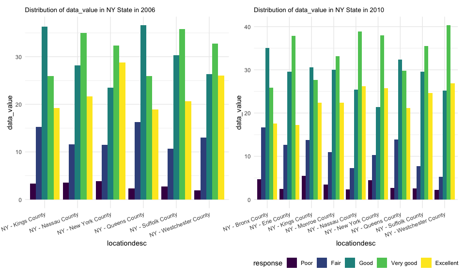
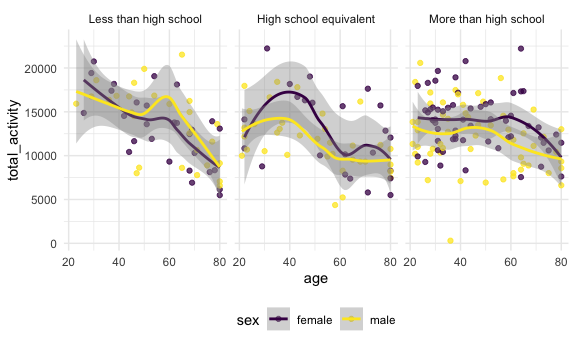

p8105_hw3_yw3996
================
Yiying Wu

## 1. Instacart data

load the data from the p8105.datasets using:

``` r
library(p8105.datasets)
data("instacart")
instacart=instacart
```

### Description of the dataset

-   This dataset contains 1384617 rows and 15 columns, with each row
    resprenting a single product from an instacart order.

-   Variables include

    -   `order_id`: order identifier
    -   `product_id`: product identifier
    -   `add_to_cart_order`: order in which each product was added to
        cart
    -   `reordered`: 1 if this prodcut has been ordered by this user in
        the past, 0 otherwise
    -   `user_id`: customer identifier
    -   `eval_set`: which evaluation set this order belongs in (Note
        that the data for use in this class is exclusively from the
        “train” eval_set)
    -   `order_number`: the order sequence number for this user
        (1=first, n=nth)
    -   `order_dow`: the day of the week on which the order was placed
    -   `order_hour_of_day`: the hour of the day on which the order was
        placed
    -   `days_since_prior_order`: days since the last order, capped at
        30, NA if order_number=1
    -   `product_name`: name of the product
    -   `aisle_id`: aisle identifier
    -   `department_id`: department identifier
    -   `aisle`: the name of the aisle
    -   `department`: the name of the department

### Count the number of aisles and the aisles with most items ordered

Count the number of aisles in the dataset:

``` r
n_distinct(instacart$aisle)
```

    ## [1] 134

Count the number of orders in each aisle and sort by descending order:

``` r
instacart |>
  group_by(aisle) |>
  summarize(n_obs = n())|>
  arrange(desc(n_obs))
```

    ## # A tibble: 134 × 2
    ##    aisle                          n_obs
    ##    <chr>                          <int>
    ##  1 fresh vegetables              150609
    ##  2 fresh fruits                  150473
    ##  3 packaged vegetables fruits     78493
    ##  4 yogurt                         55240
    ##  5 packaged cheese                41699
    ##  6 water seltzer sparkling water  36617
    ##  7 milk                           32644
    ##  8 chips pretzels                 31269
    ##  9 soy lactosefree                26240
    ## 10 bread                          23635
    ## # ℹ 124 more rows

Therefore, there are 134 aisles. The most items are ordered from fresh
vegetables aisles.

### Plot 1

the number of items ordered in each aisle (aisles with more than 10000
items ordered)

``` r
instacart |>
  group_by(aisle) |>
  summarize(n_obs = n()) |>
  filter(n_obs > 10000) |>
  mutate(aisle = fct_reorder(aisle, desc(n_obs))) |>
  ggplot(aes(x = aisle, y = n_obs)) + 
  geom_bar(stat = "identity") +  # Use geom_bar for a bar chart
  labs(title = "Number of items ordered in each aisle") +
  theme(axis.text.x = element_text(angle = 60, hjust = 1))
```


Comments:

The bar chart depicted above illustrates the quantity of items requested
from various store aisles, specifically focusing on those aisles with an
order count exceeding 10,000 items. The aisles have been organized in a
descending order according to their respective item counts, simplifying
the identification of the most frequented sections. The fresh vegetables
aisle emerges as the most popular, boasting the highest item order
count, followed by the fresh fruits and packaged vegetables fruits
sections. Conversely, aisles like oils vinegars, dry pasta, canned meals
beans, and butter exhibit the lowest order counts among the ones
presented. Nonetheless, even these less popular sections still manage to
accumulate more than 10,000 orders.

### Table 1

the three most popular items in each of the aisles “baking ingredients”,
“dog food care”, and “packaged vegetables fruits” with the number of
times each item is ordered

``` r
instacart |> 
  filter(aisle %in% c("baking ingredients", 
                      "dog food care", 
                      "packaged vegetables fruits")) |>
  group_by(aisle) |> 
  count(product_name) |> 
  mutate(rank = min_rank(desc(n))) |> 
  filter(rank < 4) |> 
  arrange(desc(n)) |>
  knitr::kable()
```

| aisle                      | product_name                                  |    n | rank |
|:---------------------------|:----------------------------------------------|-----:|-----:|
| packaged vegetables fruits | Organic Baby Spinach                          | 9784 |    1 |
| packaged vegetables fruits | Organic Raspberries                           | 5546 |    2 |
| packaged vegetables fruits | Organic Blueberries                           | 4966 |    3 |
| baking ingredients         | Light Brown Sugar                             |  499 |    1 |
| baking ingredients         | Pure Baking Soda                              |  387 |    2 |
| baking ingredients         | Cane Sugar                                    |  336 |    3 |
| dog food care              | Snack Sticks Chicken & Rice Recipe Dog Treats |   30 |    1 |
| dog food care              | Organix Chicken & Brown Rice Recipe           |   28 |    2 |
| dog food care              | Small Dog Biscuits                            |   26 |    3 |

Comments:

This table provides information on the top-ranked products within
various categories in a store.

-   Packaged Vegetables & Fruits:

    -   Organic Baby Spinach: This product is the most popular in the
        “Packaged Vegetables Fruits” category, with a substantial count
        of 9784. It’s evident that customers prefer healthy, organic
        greens.
    -   Organic Raspberries: Ranked second, “Organic Raspberries” also
        enjoys significant popularity with 5546 purchases.
    -   Organic Blueberries: “Organic Blueberries” holds the third
        position, highlighting the appeal of organic fruits among
        shoppers.

-   Baking Ingredients:

    -   Light Brown Sugar: In the “Baking Ingredients” category, “Light
        Brown Sugar” tops the list with 499 purchases. It’s a staple for
        baking enthusiasts.
    -   Pure Baking Soda: “Pure Baking Soda” is the second most
        purchased product within this category, reflecting its
        importance in baking.
    -   Cane Sugar: While “Cane Sugar” ranks third, it still enjoys a
        notable 336 purchases, indicating the demand for various
        sweeteners in baking.

-   Dog Food Care:

    -   Snack Sticks Chicken & Rice Recipe Dog Treats: This product is
        the most popular in the “Dog Food Care” category, showing that
        pet owners prioritize treats for their dogs.
    -   Organix Chicken & Brown Rice Recipe: Ranked second, “Organix
        Chicken & Brown Rice Recipe” caters to health-conscious pet
        owners.
    -   Small Dog Biscuits: This product is the third most purchased,
        demonstrating that even small dog breeds have their specific
        dietary needs.

### Table 2

the mean hour of the day at which Pink Lady Apples and Coffee Ice Cream
are ordered on each day of the week; format this table for human readers
(i.e. produce a 2 x 7 table).

``` r
instacart |>
  filter(product_name %in% c("Pink Lady Apples", "Coffee Ice Cream")) |>
  group_by(product_name, order_dow) |>
  summarize(mean_hour = mean(order_hour_of_day,na.rm=TRUE),.groups="drop") |>
  mutate(order_dow = case_when(
    order_dow == 0 ~ "Monday",
    order_dow == 1 ~ "Tuesday",
    order_dow == 2 ~ "Wednesday",
    order_dow == 3 ~ "Thursday",
    order_dow == 4 ~ "Friday",
    order_dow == 5 ~ "Saturday",
    order_dow == 6 ~ "Sunday"
  ))|>
  pivot_wider(
    names_from = "order_dow", 
    values_from = "mean_hour")|>
  knitr::kable(digits = 2)
```

| product_name     | Monday | Tuesday | Wednesday | Thursday | Friday | Saturday | Sunday |
|:-----------------|-------:|--------:|----------:|---------:|-------:|---------:|-------:|
| Coffee Ice Cream |  13.77 |   14.32 |     15.38 |    15.32 |  15.22 |    12.26 |  13.83 |
| Pink Lady Apples |  13.44 |   11.36 |     11.70 |    14.25 |  11.55 |    12.78 |  11.94 |

Comments:

The table presents the typical ordering times for “Coffee Ice Cream” and
“Pink Lady Apples” throughout the week. In the case of “Coffee Ice
Cream,” the mean order time falls within the early to mid-afternoon
range for all days. It commences at approximately 1:45 PM on Monday and
reaches its latest around 3:30 PM on Thursday. Conversely, “Pink Lady
Apples” consistently exhibit an average ordering time in the early
afternoon for the entire week. This timing begins at roughly 11:30 AM on
Tuesday and experiences slight variations but generally remains within
the early to mid-afternoon timeframe for the remaining days.

## 2. BRFSS data

load the data from the p8105.datasets using:

``` r
data("BRFSS")
brfss=brfss_smart2010
```

### data cleaning

-   format the data to use appropriate variable names;
-   focus on the “Overall Health” topic
-   include only responses from “Excellent” to “Poor”
-   organize responses as a factor taking levels ordered from “Poor” to
    “Excellent”

list all the value of response column:

``` r
brfss=brfss|>
  janitor::clean_names()|>
  mutate(data_value=as.double(data_value))
unique(brfss$response)
```

    ##  [1] "Excellent"                                 
    ##  [2] "Very good"                                 
    ##  [3] "Good"                                      
    ##  [4] "Fair"                                      
    ##  [5] "Poor"                                      
    ##  [6] "Good or Better Health"                     
    ##  [7] "Fair or Poor Health"                       
    ##  [8] "Yes"                                       
    ##  [9] "No"                                        
    ## [10] "Yes, pregnancy-related"                    
    ## [11] "No, pre-diabetes or borderline diabetes"   
    ## [12] "Smoke everyday"                            
    ## [13] "Smoke some days"                           
    ## [14] "Former smoker"                             
    ## [15] "Never smoked"                              
    ## [16] "Neither overweight nor obese (BMI le 24.9)"
    ## [17] "Overweight (BMI 25.0-29.9)"                
    ## [18] "Obese (BMI 30.0 - 99.8)"                   
    ## [19] "Checked in past 5 years"                   
    ## [20] "Not Checked in past 5 years"               
    ## [21] "Never Checked"                             
    ## [22] "Consume 5 or more times per day"           
    ## [23] "Consume less than 5 times per day"

The responses should be included are “Excellent”, “Very good”, “Good”,
“Fair”, “Poor”.

The order should be “Poor”, “Fair”, “Good”, “Very good”, “Excellent”

``` r
brfss=brfss|>
  filter(
    topic=="Overall Health",
    response %in% c("Poor", "Fair", "Good", 
                    "Very good", "Excellent"))|>
  mutate(
    response=factor(response, levels=c("Poor", "Fair", "Good", 
                                       "Very good", "Excellent"))
  )
```

### states observed at 7 or more locations in 2002 or in 2010

states were observed at 7 or more locations in 2002 are:

``` r
brfss|>
  filter(year==2002)|>
  group_by(locationabbr)|>
  summarize(n_obs = n_distinct(locationdesc))|>
  filter(n_obs>=7)
```

    ## # A tibble: 6 × 2
    ##   locationabbr n_obs
    ##   <chr>        <int>
    ## 1 CT               7
    ## 2 FL               7
    ## 3 MA               8
    ## 4 NC               7
    ## 5 NJ               8
    ## 6 PA              10

CT, FL, MA, NC, NJ, PA were observed at 7 or more locations in 2002.

states were observed at 7 or more locations in 2010 are:

``` r
brfss|>
  filter(year==2010)|>
  group_by(locationabbr)|>
  summarize(n_obs = n_distinct(locationdesc))|>
  filter(n_obs>=7)
```

    ## # A tibble: 14 × 2
    ##    locationabbr n_obs
    ##    <chr>        <int>
    ##  1 CA              12
    ##  2 CO               7
    ##  3 FL              41
    ##  4 MA               9
    ##  5 MD              12
    ##  6 NC              12
    ##  7 NE              10
    ##  8 NJ              19
    ##  9 NY               9
    ## 10 OH               8
    ## 11 PA               7
    ## 12 SC               7
    ## 13 TX              16
    ## 14 WA              10

CA, CO, FL, MA, MD, NC, NE, NJ, NY, OH, PA, SC, TX, WA were observed at
7 or more locations in 2010.

### Construct a dataset with Excellent responses including year, state, and a variable that averages the data_value across locations within a state

``` r
dat = brfss|>
  filter(response=="Excellent")|>
  group_by(year, locationabbr)|>
  summarize(data_value_mean=mean(data_value, na.rm = TRUE))
```

    ## `summarise()` has grouped output by 'year'. You can override using the
    ## `.groups` argument.

### spaghetti plot

``` r
dat|>
  rename("state"="locationabbr")|>
  ggplot(aes(x = year, y = data_value_mean, 
             color =state )) + 
  geom_point() + geom_line() + 
  theme(legend.position = "bottom")+
  guides(color = guide_legend(nrow = 5))
```


Comments:

The average data_value for excellent response fluctuate from 2002 to
2010. For most of the states average data_value for excellent response
is roughly between 17 to 27.

### two-panel plot

two-panel plot showing, for the years 2006, and 2010, distribution of
data_value for responses (“Poor” to “Excellent”) among locations in NY
State.

``` r
plot=
  brfss |>
  filter(locationabbr=="NY"& year %in% c(2006,2010))|>
  ggplot(aes(x =response , y = data_value)) + 
  geom_boxplot()+
  labs(title = "Distribution of data_value in NY State in 2006 and 2010") +
  facet_grid(.~year)

plot
```


Comments:

-   In both 2006 and 2010, the “Poor” responses exhibit the lowest
    median data values, and the “Good”, “Very Good”, and “Excellent”
    responses tend to have significantly higher data values compared to
    those with “Poor” or “Fair” responses.
-   The “Fair” responses in 2010 have a greater variation compared to
    those in 2002.
-   The “Good” responses in 2010 have smaller variation compared to
    those in 2002.
-   The “Very Good” responses in 2010 have a higher median and larger
    variation compared to those in 2002.

two-panel plot showing, for the years 2006, and 2010, distribution of
data_value for responses (“Poor” to “Excellent”) in different locations
in NY State.

``` r
plot_2006=
  brfss |>
  filter(locationabbr=="NY",year==2006)|>
  ggplot(aes(x =locationdesc , y = data_value,fill=response)) + 
  geom_bar(position="dodge",stat="identity") +  
  labs(title = "Distribution of data_value in NY State in 2006") + 
  theme(plot.title = element_text(size = 10), axis.text.x = element_text(angle = 20, hjust = 1),legend.position = "none") 

plot_2010=
  brfss |>
  filter(locationabbr=="NY",year==2010)|>
  ggplot(aes(x =locationdesc , y = data_value,fill=response)) + 
  geom_bar(position="dodge",stat="identity") +  
  labs(title = "Distribution of data_value in NY State in 2010") +
  theme(plot.title = element_text(size = 10), axis.text.x = element_text(angle = 20, hjust = 1))

plot_2006 + plot_2010
```


Comments:

There are 6 counties responded in 2006, while 9 counties in 2010. The
overall distribution seems consistent between two years, while there is
variation among counties.

## 3. Accelerometer data

import dataset

``` r
demographic=read_csv("./data/nhanes_covar.csv",skip = 4)|>
  janitor::clean_names()
accelerometer=read_csv("./data/nhanes_accel.csv")|>
  janitor::clean_names()
```

### data cleaning

clean `demographic` dataset:

-   include all originally observed variables;
-   exclude participants less than 21 years of age, and those with
    missing demographic data; and
-   encode data with reasonable variable classes

``` r
demographic=demographic|>
  drop_na()|>
  filter(age>=21,!is.na(sex), !is.na(age), !is.na(bmi), !is.na(education))|>
  mutate(
     sex=case_match(
       sex,
       1~"male",
       2~"female"),
     education=case_match(
       education,
       1~"Less than high school",
       2~"High school equivalent",
       3~"More than high school"
     ),
     education=factor(education, levels=c(
       "Less than high school",
       "High school equivalent",
       "More than high school"))
  )
```

clean `accelerometer` data

-   pivot longer

``` r
accelerometer=accelerometer|>
  drop_na()|>
  pivot_longer(
    min1:min1440,
    names_to = "time", 
    values_to = "mims_value")|>
  separate(time,into=c("min","minute"),3)|>
  select(-min)|>
  mutate(minute=as.integer(minute))
```

join `accelerometer` with `demographic`

``` r
dat_3=
  inner_join(demographic,accelerometer,by="seqn")
```

### table for the number of men and women in each education category

``` r
dat_3|>
  group_by(sex,education) |> 
  summarize(n_obs = n_distinct(seqn)) |> 
  pivot_wider(names_from = education, values_from = n_obs)|>
  knitr::kable()
```

    ## `summarise()` has grouped output by 'sex'. You can override using the `.groups`
    ## argument.

| sex    | Less than high school | High school equivalent | More than high school |
|:-------|----------------------:|-----------------------:|----------------------:|
| female |                    28 |                     23 |                    59 |
| male   |                    27 |                     35 |                    56 |

Comments:

-   Among both genders, the “More than high school” education category
    has the highest count, indicating that a significant portion of the
    sampled population has education beyond high school.
-   In the “High school equivalent” category, there are slightly more
    males (35) than females (23).
-   The counts in “Less than high school” category are close, with 28
    females and 27 males.

### visualization of the age distributions for men and women in education category

``` r
dat_3 |> 
  group_by(education,seqn)|>
  distinct(seqn,sex,age,education)|>
  ggplot(aes(x = age, fill = education)) + 
  labs(title = "Male") +
  geom_density(alpha = .5) +
  facet_grid(.~sex)
```


Comments:

-   Among both genders, the age distributions for “More than high
    school” education category are right-skewed, while age distributions
    for “Less than high school” education category are left-skewed,
    indicating that young people tend to have higher education levels.
-   The difference of the distributions among education categories for
    female is more significant than that of male group. This suggests
    that gender may play a role in shaping educational attainment
    patterns, with females showing a greater variation in age across
    education levels.

### analysis total activity variable for each participant

create a total activity variable for each participant

``` r
total_act=dat_3|>
  group_by(seqn,sex,age,bmi,education)|>
  summarise(total_activity=sum(mims_value))
```

    ## `summarise()` has grouped output by 'seqn', 'sex', 'age', 'bmi'. You can
    ## override using the `.groups` argument.

Plot these total activities (y-axis) against age (x-axis)

``` r
total_act|>
  ggplot(aes(x = age, y = total_activity, color = sex)) + 
  geom_point(alpha = .75)+
  geom_smooth()+
  facet_grid(.~education)
```

    ## `geom_smooth()` using method = 'loess' and formula = 'y ~ x'



Comments:

-   Overall, both young females and young males tend to have higher
    total activities in all education groups.
-   For “High school equivalent” and “More than high school” groups, the
    total activities for females are slightly higher than those for
    males.
-   Since there are a lot of overlap between the confidence intervals
    between females and males for all education groups, total activities
    is not statistically significant difference between the genders
    across these education categories.
-   Both females and males tend to have a smaller variation of total
    activities in ages within the ‘More than high school’ education
    category compared to the other two education categories.

### Inspection activity over the course of the day

three-panel plot that shows the 24-hour activity time courses for each
education level and use color to indicate sex:

``` r
dat_3|>
  group_by(minute, sex, education)|>
  summarise(mims_value=mean(mims_value))|>
  ggplot(aes(x = minute, y = mims_value, color = sex)) + 
  geom_point(alpha = .75)+
  geom_smooth()+
  facet_grid(.~education)
```

    ## `summarise()` has grouped output by 'minute', 'sex'. You can override using the
    ## `.groups` argument.
    ## `geom_smooth()` using method = 'gam' and formula = 'y ~ s(x, bs = "cs")'


Comments:

-   Overall, both females and males tend to have higher MIMS values from
    8:30 to 20:00 (i.e. 510\~1200 minute) in all education groups.
-   MIMS values will increase dramatically since 4:00, and reach the
    peak at around 8:30. Then it will decrease slightly from 8:30 to
    20:00, and drop dramatically after 20:00.
-   Both females and males tend to have higher peak MIMS values within
    the ‘Less than high school’ education category compared to the other
    two education categories. This suggests that educational attainment
    may be associated with differences in peak MIMS values, with lower
    education levels potentially correlating with higher peak MIMS
    scores.
-   For “High school equivalent” and “More than high school” groups,
    females tend to have higher MIMS values than males from 8:30 to
    20:00 while MIMS values are similar between genders in ‘Less than
    high school’ education category.
